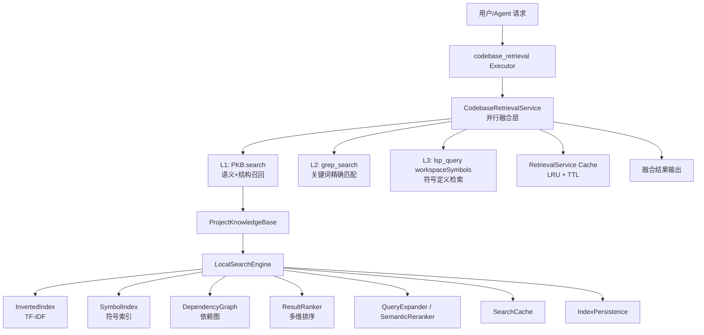
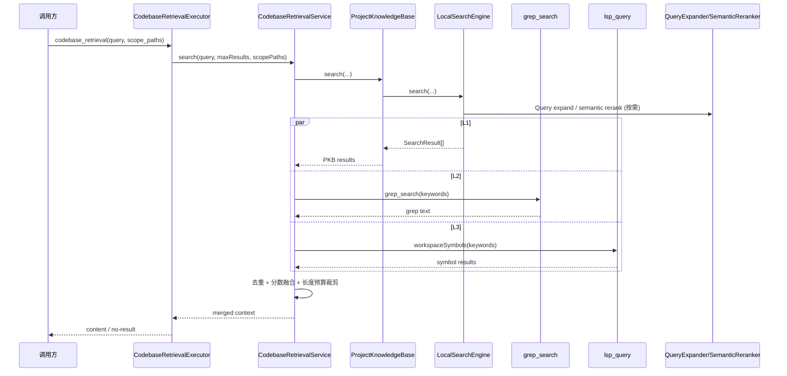

# Magi 本地索引方案速览

> 目标：让使用者在 3-5 分钟内理解当前本地检索的核心设计、数据流与关键机制。

## 1. 一句话总结

当前方案是 **“索引内核 + 三层检索融合 + LLM 辅助增强”**：

- 索引内核：`InvertedIndex + SymbolIndex + DependencyGraph`
- 检索融合：`L1(PKB) + L2(Grep) + L3(LSP)` 并行执行
- LLM 辅助：`QueryExpander`（查询扩展）与 `SemanticReranker`（语义重排）
- 保障机制：增量更新串行化、查询前一致性对账、缓存与持久化恢复

---

## 2. 分层架构图（Mermaid）

---

## 3. 查询执行时序（Mermaid）

---

## 4. 索引构建与更新

### 4.1 启动构建

1. `ProjectKnowledgeBase.initialize()` 启动
2. 先尝试 `restoreAndSync` 恢复本地索引快照
3. 恢复失败则执行全量构建（倒排/符号/依赖图并行）
4. 构建完成后保存索引与扩展缓存

### 4.2 增量更新

- 文件事件入口：`onFileEvent(changed/created/deleted)`
- 先做短窗口合并（防抖）
- 再进入 `LocalSearchEngine` 串行 mutation queue
- 更新后：
  - 刷新索引与词表脏标记
  - 按文件失效缓存
  - 持久化防抖保存

### 4.3 查询前一致性

每次搜索前都会执行：

- 等待增量队列完成
- 对账 `indexedFiles` 与文件系统状态（mtime/size）
- 自动修复漂移后再查询

> 这一步是保证“索引结果不落后文件系统状态”的关键。

### 4.4 LLM 辅助触发策略

- **QueryExpander（查询扩展）**：主要用于语义查询；符号型查询默认不扩展，避免噪声
- **SemanticReranker（语义重排）**：在候选集上进行语义精排，提升 Top 结果相关性
- **降级策略**：LLM 不可用时仍可走纯本地索引与三层检索主链路

---

## 5. 排序与结果组装

## 5.1 多维排序信号

- `tfidf`
- `symbolMatch`
- `positionWeight`
- `centrality`
- `recency`
- `typeWeight`
- `recentEditBoost`
- `scopeBoost`

## 5.2 结果增强

- Top 结果可做依赖图 1-hop 扩展
- 可做语义重排（有 LLM 客户端时）
- snippet 提取优先使用命中行/符号边界，避免无意义大片段

---

## 6. 方案优势

1. **召回稳健**：语义、关键词、符号三路并行，降低单路失效风险
2. **一致性强**：查询前对账 + 串行增量更新，避免“索引脏读”
3. **工程可控**：缓存、持久化、限长预算、作用域过滤都可观测
4. **可扩展**：索引层和融合层边界清晰，后续可独立优化

---

## 7. 已知边界（使用时注意）

1. `shouldIgnore` 为关键词包含匹配，不是严格 glob 引擎语义
2. L2/L3 去重是按段落含路径的启发式，极端文本可能去重不完全
3. RetrievalService 缓存键不含索引版本号，依赖 TTL 控制短时陈旧

---

## 8. 适用场景建议

- **优先使用**：未知代码位置、跨模块定位、先理解后修改
- **次选**：已知精确路径/符号时，直接文件读取或定点搜索更快

---

## 9. 关键源码入口

- `src/tools/codebase-retrieval-executor.ts`
- `src/services/codebase-retrieval-service.ts`
- `src/knowledge/project-knowledge-base.ts`
- `src/knowledge/local-search-engine.ts`
