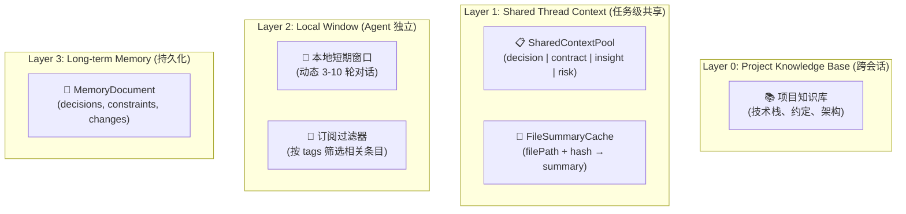
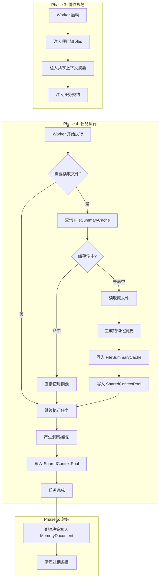

# MultiCLI 统一上下文与记忆系统设计

> 版本: 2.0 | 更新日期: 2025-02-06

## 文档关系说明

本文档与其他设计文档的关系：

| 文档 | 定义 | 关系 |
|------|------|------|
| **workflow-design.md** | 5 阶段工作流架构 | 本文档在 Phase 3-4 增强上下文注入 |
| **ux-flow-specification.md** | UI/UX 交互规范 | 无直接影响 |
| **context-compression-format-reference.md** | 上下文压缩格式 | 本文档复用其摘要结构 |

---

## 一、背景与问题

### 1.1 问题现状

多 Worker 并行/串行执行时，常出现重复读取同一批文件的现象，导致时间与 token 成本显著上升。

```text
┌─────────────────────────────────────────────────────────────────────────────┐
│                          当前问题：重复读取与知识断层                          │
├─────────────────────────────────────────────────────────────────────────────┤
│                                                                             │
│   用户请求: "重构这个模块的错误处理"                                          │
│       │                                                                     │
│       ▼                                                                     │
│   ┌─────────────┐                                                           │
│   │ Orchestrator│ ── 分析需求，分配 Worker                                   │
│   └─────────────┘                                                           │
│       │                                                                     │
│       ├────────────────────────┬────────────────────────┐                   │
│       ▼                        ▼                        ▼                   │
│   ┌─────────┐              ┌─────────┐              ┌─────────┐             │
│   │ Claude  │              │ Codex   │              │ Gemini  │             │
│   │ Worker  │              │ Worker  │              │ Worker  │             │
│   └────┬────┘              └────┬────┘              └────┬────┘             │
│        │                        │                        │                  │
│        ▼                        ▼                        ▼                  │
│   ┌─────────┐              ┌─────────┐              ┌─────────┐             │
│   │read_file│              │read_file│              │read_file│             │
│   │ src/a.ts│              │ src/a.ts│ ← 重复读取!  │ src/a.ts│ ← 重复读取!  │
│   │ src/b.ts│              │ src/b.ts│ ← 重复读取!  │ src/c.ts│             │
│   └─────────┘              └─────────┘              └─────────┘             │
│                                                                             │
│   ❌ 问题 1: 同一文件被多个 Worker 重复读取，浪费 token                        │
│   ❌ 问题 2: Worker 之间无法共享理解结论，存在知识断层                         │
│   ❌ 问题 3: 无过期机制，文件变更后旧理解仍被使用                              │
│                                                                             │
└─────────────────────────────────────────────────────────────────────────────┘
```

### 1.2 核心问题

| 问题 | 影响 | 根因 |
|------|------|------|
| 重复文件读取 | Token 成本放大 2-3 倍 | 无跨 Worker 缓存机制 |
| 知识断层 | Worker 各自为战，结论可能冲突 | 无共享上下文池 |
| 历史污染 | 旧理解误导当前任务 | 无过期/去重策略 |

### 1.3 现有系统能力

| 组件 | 状态 | 能力 |
|------|------|------|
| `ContextManager` | ✅ 已有 | 即时上下文 + 会话记忆 + 项目知识库注入 |
| `MemoryDocument` | ✅ 已有 | 决策、约束、代码变更记录 |
| `ProjectKnowledgeBase` | ✅ 已有 | 项目技术栈、约定、架构 |
| `SharedContextPool` | ❌ 缺失 | **本文档重点补齐** |
| `FileSummaryCache` | ❌ 缺失 | **本文档重点补齐** |

---

## 二、目标与约束

### 2.1 设计目标

1. **减少重复读取**：同一文件不被多个 Worker 重复读取（缓存命中率 > 80%）
2. **知识共享**：Worker 能获取其他 Worker 的关键发现
3. **来源追踪**：每条共享内容带 `source` + `createdAt` 可追溯
4. **预算可控**：上下文总 token 保持在预算内，不爆炸
5. **自动失效**：文件变更后旧缓存自动失效

### 2.2 设计约束

| 约束 | 说明 | 原因 |
|------|------|------|
| 不打破 5 阶段工作流 | 仅在上下文编排层增强 | 保持架构稳定 |
| 共享摘要而非原文 | 禁止存储整段原文 | 控制 token 预算 |
| 低耦合 | 上下文系统独立于 Worker 实现 | 便于扩展和测试 |
| 任务隔离 | 不同 Mission 的上下文互不污染 | 防止信息泄露 |

---

## 三、设计原则

```text
┌────────────────────────────────────────────────────────────────┐
│                      设计原则金字塔                              │
├────────────────────────────────────────────────────────────────┤
│                                                                │
│                    ┌──────────────┐                            │
│                    │  预算优先    │  Token 预算 > 内容完整性     │
│                    └──────────────┘                            │
│               ┌────────────────────────┐                       │
│               │   共享最小化           │  摘要 > 原文            │
│               └────────────────────────┘                       │
│          ┌──────────────────────────────────┐                  │
│          │      可追踪                       │  来源 + 时间戳     │
│          └──────────────────────────────────┘                  │
│     ┌────────────────────────────────────────────┐             │
│     │           可失效                            │  Hash 绑定    │
│     └────────────────────────────────────────────┘             │
│                                                                │
└────────────────────────────────────────────────────────────────┘
```

| 原则 | 说明 | 实现方式 |
|------|------|----------|
| **预算优先** | 上下文拼装必须遵循 token 预算分配 | 超限时按 importance 裁剪 |
| **共享最小化** | 共享的是"摘要与关键结论"，非原始全文 | 结构化摘要模板 |
| **可追踪** | 每条记录必须标注来源 Worker 与时间 | `source` + `createdAt` 字段 |
| **可失效** | 文件摘要必须绑定 hash，变更即失效 | `filePath + fileHash` 作为 key |
| **低耦合** | 上下文系统独立于具体 Worker 实现 | 通过接口抽象 |

---

## 四、分层架构

### 4.1 四层模型



### 4.2 层级职责

| 层级 | 名称 | 范围 | 职责 | 生命周期 |
|------|------|------|------|----------|
| **L0** | Project Knowledge Base | 跨会话 | 项目技术栈、约定、架构 | 持久化 |
| **L1** | Shared Thread Context | Mission 级 | 共享的摘要、决策、契约、风险 | Mission 结束清理 |
| **L2** | Local Window | Agent 独立 | 最近 N 轮对话 + 订阅过滤 | 实时滚动 |
| **L3** | Long-term Memory | 跨 Mission | MemoryDocument 稳定事实 | 持久化 |

### 4.3 数据流向

```text
┌─────────────────────────────────────────────────────────────────────────────┐
│                              数据流向示意                                    │
├─────────────────────────────────────────────────────────────────────────────┤
│                                                                             │
│   ┌──────────────────────────────────────────────────────────────────────┐  │
│   │                         写入路径 (Write Path)                         │  │
│   ├──────────────────────────────────────────────────────────────────────┤  │
│   │                                                                      │  │
│   │   Worker 读取文件 ─────► 生成摘要 ─────► FileSummaryCache            │  │
│   │                                    │                                 │  │
│   │                                    └───► SharedContextPool           │  │
│   │                                                                      │  │
│   │   Worker 产生洞察 ─────► 结构化 ──────► SharedContextPool            │  │
│   │                                                                      │  │
│   │   Orchestrator 决策 ───► 记录 ────────► SharedContextPool            │  │
│   │                                    └───► MemoryDocument (关键决策)   │  │
│   │                                                                      │  │
│   └──────────────────────────────────────────────────────────────────────┘  │
│                                                                             │
│   ┌──────────────────────────────────────────────────────────────────────┐  │
│   │                         读取路径 (Read Path)                          │  │
│   ├──────────────────────────────────────────────────────────────────────┤  │
│   │                                                                      │  │
│   │   Worker 启动 ─────► 读取 SharedContextPool (按订阅筛选)             │  │
│   │              │                                                       │  │
│   │              └────► 读取 ProjectKnowledgeBase                        │  │
│   │                                                                      │  │
│   │   Worker 需要文件 ─► 查询 FileSummaryCache ─┬─► 命中: 使用摘要       │  │
│   │                                            └─► 未命中: 读取原文件    │  │
│   │                                                                      │  │
│   └──────────────────────────────────────────────────────────────────────┘  │
│                                                                             │
└─────────────────────────────────────────────────────────────────────────────┘
```

---

## 五、核心数据结构

### 5.1 SharedContextEntry（共享上下文条目）

```typescript
// src/context/shared-context-pool.ts

/**
 * 共享上下文条目类型
 */
type SharedContextEntryType =
  | 'decision'      // 编排者决策
  | 'contract'      // 任务契约
  | 'file_summary'  // 文件摘要
  | 'risk'          // 风险标记
  | 'constraint'    // 用户约束
  | 'insight';      // Worker 洞察

/**
 * 重要性级别
 */
type ImportanceLevel = 'critical' | 'high' | 'medium' | 'low';

/**
 * 来源标识
 */
type ContextSource = 'orchestrator' | 'claude' | 'codex' | 'gemini';

/**
 * 文件引用
 */
interface FileReference {
  path: string;
  hash: string;
}

/**
 * 共享上下文条目
 */
interface SharedContextEntry {
  /** 唯一标识 */
  id: string;

  /** 任务/编排上下文范围（Mission ID） */
  missionId: string;

  /** 来源：orchestrator | claude | codex | gemini */
  source: ContextSource;

  /** 类型：decision | contract | file_summary | risk | constraint | insight */
  type: SharedContextEntryType;

  /** 精炼后的摘要文本（非原文） */
  content: string;

  /** 标签（用于订阅筛选） */
  tags: string[];

  /** 关联文件路径与 hash */
  fileRefs?: FileReference[];

  /** 重要性级别 */
  importance: ImportanceLevel;

  /** 生成时间 */
  createdAt: number;

  /** 失效时间（可选） */
  expiresAt?: number;
}
```

### 5.2 FileSummaryCacheEntry（文件摘要缓存条目）

```typescript
// src/context/file-summary-cache.ts

/**
 * 文件摘要缓存条目
 */
interface FileSummaryCacheEntry {
  /** 文件路径 */
  filePath: string;

  /** 文件内容 hash（变更即失效） */
  fileHash: string;

  /** 结构化摘要（200-500 tokens） */
  summary: FileSummary;

  /** 产生者 */
  source: ContextSource;

  /** 更新时间 */
  updatedAt: number;
}

/**
 * 结构化文件摘要
 */
interface FileSummary {
  /** 文件目的/职责 */
  purpose: string;

  /** 核心逻辑概述 */
  coreLogic: string;

  /** 关键接口/导出 */
  keyExports?: string[];

  /** 依赖关系 */
  dependencies?: string[];

  /** 代码行数 */
  lineCount: number;

  /** 是否包含敏感逻辑 */
  hasSensitiveLogic?: boolean;
}
```

### 5.3 ContextAssemblyOptions（上下文组装选项）

```typescript
// src/context/context-assembler.ts

/**
 * Agent 上下文订阅配置
 */
interface AgentContextSubscription {
  /** Agent 标识 */
  agentId: string;

  /** 订阅的标签（例如 ['architecture', 'api-design']） */
  subscribedTags: string[];

  /** 排除的来源（可选） */
  excludedSources?: ContextSource[];
}

/**
 * Token 预算配置
 */
interface TokenBudgetConfig {
  /** 总预算 */
  total: number;

  /** 项目知识库占比 (默认 10%) */
  projectKnowledgeRatio: number;

  /** 共享上下文占比 (默认 25%) */
  sharedContextRatio: number;

  /** 契约与变更占比 (默认 15%) */
  contractsRatio: number;

  /** 本地对话占比 (默认 40%) */
  localWindowRatio: number;

  /** 长期记忆占比 (默认 10%) */
  longTermMemoryRatio: number;
}

/**
 * 上下文组装选项
 */
interface ContextAssemblyOptions {
  /** Mission ID */
  missionId: string;

  /** Agent 订阅配置 */
  subscription: AgentContextSubscription;

  /** Token 预算配置 */
  budget: TokenBudgetConfig;

  /** 最小重要性级别 */
  minImportance?: ImportanceLevel;

  /** 本地对话轮数范围 */
  localTurns?: {
    min: number;
    max: number;
  };
}

### 5.4 与现有 MemoryDocument 的复用

```typescript
// 复用现有 src/context/memory-document.ts 结构

/**
 * MemoryDocument（长期记忆）- 已有结构
 */
interface MemoryContent {
  /** 用户核心意图 */
  primaryIntent: string;

  /** 用户强调的约束 */
  userConstraints: string[];

  /** 当前任务列表 */
  currentTasks: string[];

  /** 关键决策记录 */
  keyDecisions: KeyDecision[];

  /** 重要上下文 */
  importantContext: string[];

  /** 代码变更记录 */
  codeChanges: CodeChange[];

  /** 待处理问题 */
  pendingIssues: string[];
}

/**
 * 关键决策
 */
interface KeyDecision {
  decision: string;
  reason: string;
  timestamp: number;
  source?: ContextSource;
}

/**
 * 代码变更
 */
interface CodeChange {
  file: string;
  type: 'create' | 'modify' | 'delete';
  summary: string;
  timestamp: number;
}
```

---

## 六、写入规则

### 6.1 写入触发点

| 触发点 | 写入类型 | 写入目标 | 触发条件 |
|--------|----------|----------|----------|
| Worker 读取文件并形成结论 | `file_summary` | FileSummaryCache + SharedContextPool | 文件首次被理解 |
| 生成契约 | `contract` | SharedContextPool | 任务分配时 |
| 关键决策 | `decision` | SharedContextPool + MemoryDocument | 编排者决策 |
| 风险评估 | `risk` | SharedContextPool | 发现冲突/风险 |
| 用户补充约束 | `constraint` | SharedContextPool | 用户追加指令 |
| Worker 执行完成 | `insight` | SharedContextPool | 产生关键结论 |

### 6.2 写入约束

```typescript
/**
 * 写入规则验证器
 */
interface WriteValidator {
  /**
   * 验证是否允许写入
   */
  validate(entry: SharedContextEntry): ValidationResult;
}

interface ValidationResult {
  allowed: boolean;
  reason?: string;
}

// 规则实现
const writeRules: WriteValidator[] = [
  // 规则 1: 必须摘要化，禁止存整段原文
  {
    validate(entry) {
      const maxContentLength = 2000; // 约 500 tokens
      if (entry.content.length > maxContentLength) {
        return {
          allowed: false,
          reason: `内容过长 (${entry.content.length} > ${maxContentLength})，请摘要后写入`
        };
      }
      return { allowed: true };
    }
  },

  // 规则 2: 同一 filePath + fileHash 不重复写入
  {
    validate(entry) {
      if (entry.type === 'file_summary' && entry.fileRefs) {
        // 检查是否已存在相同 hash 的摘要
        // 实现时调用 FileSummaryCache.has(filePath, hash)
      }
      return { allowed: true };
    }
  },

  // 规则 3: 必须带来源和时间戳
  {
    validate(entry) {
      if (!entry.source || !entry.createdAt) {
        return {
          allowed: false,
          reason: '缺少来源或时间戳'
        };
      }
      return { allowed: true };
    }
  }
];
```

### 6.3 摘要生成模板

```typescript
/**
 * 文件摘要生成提示模板
 */
const FILE_SUMMARY_PROMPT = `
请为以下文件生成结构化摘要，格式如下：

## 文件摘要
- **文件路径**: {filePath}
- **目的/职责**: 一句话描述文件的核心职责
- **核心逻辑**: 2-3 句话概述主要逻辑流程
- **关键导出**: 列出主要的类、函数、接口（最多 5 个）
- **依赖关系**: 列出主要依赖（最多 3 个）
- **代码行数**: {lineCount}

要求：
1. 摘要总长度不超过 500 tokens
2. 使用中文
3. 关注"做什么"而非"怎么做"
`;

/**
 * 洞察摘要生成提示模板
 */
const INSIGHT_SUMMARY_PROMPT = `
请将以下理解结论转换为结构化洞察，格式如下：

## 洞察摘要
- **类型**: decision | risk | constraint | insight
- **核心结论**: 一句话描述关键发现
- **影响范围**: 涉及的文件/模块
- **相关标签**: 用于检索的关键词（如 api-design, database）
- **重要性**: critical | high | medium | low

要求：
1. 摘要总长度不超过 300 tokens
2. 确保可被其他 Worker 理解和复用
`;
```

---

## 七、读取与上下文拼装策略

### 7.1 Token 预算分配

```text
┌────────────────────────────────────────────────────────────────┐
│                     Token 预算分配 (默认配置)                    │
├────────────────────────────────────────────────────────────────┤
│                                                                │
│   ┌──────────────────────────────────────────────────────────┐ │
│   │  项目知识库 (L0)                               10%       │ │
│   │  ████████                                                │ │
│   └──────────────────────────────────────────────────────────┘ │
│                                                                │
│   ┌──────────────────────────────────────────────────────────┐ │
│   │  共享任务上下文 (L1) - 高优先级条目            25%       │ │
│   │  ████████████████████████                                │ │
│   └──────────────────────────────────────────────────────────┘ │
│                                                                │
│   ┌──────────────────────────────────────────────────────────┐ │
│   │  任务契约与关键变更 (L1)                       15%       │ │
│   │  ████████████████                                        │ │
│   └──────────────────────────────────────────────────────────┘ │
│                                                                │
│   ┌──────────────────────────────────────────────────────────┐ │
│   │  本地最近 N 轮对话 (L2)                        40%       │ │
│   │  ████████████████████████████████████████████            │ │
│   └──────────────────────────────────────────────────────────┘ │
│                                                                │
│   ┌──────────────────────────────────────────────────────────┐ │
│   │  长期记忆召回 (L3)                             10%       │ │
│   │  ████████                                                │ │
│   └──────────────────────────────────────────────────────────┘ │
│                                                                │
└────────────────────────────────────────────────────────────────┘
```

### 7.2 上下文组装流水线

```typescript
// src/context/context-assembler.ts

/**
 * 上下文组装器
 */
class ContextAssembler {
  constructor(
    private projectKnowledgeBase: ProjectKnowledgeBase,
    private sharedContextPool: SharedContextPool,
    private fileSummaryCache: FileSummaryCache,
    private memoryDocument: MemoryDocument
  ) {}

  /**
   * 组装上下文
   */
  async assemble(options: ContextAssemblyOptions): Promise<AssembledContext> {
    const { missionId, subscription, budget } = options;
    const parts: ContextPart[] = [];
    let remainingTokens = budget.total;

    // 1. 项目知识库 (10%)
    const pkbBudget = Math.floor(budget.total * budget.projectKnowledgeRatio);
    const pkb = await this.projectKnowledgeBase.getContext(pkbBudget);
    if (pkb) {
      const tokens = this.estimateTokens(pkb);
      parts.push({ type: 'project_knowledge', content: pkb, tokens });
      remainingTokens -= tokens;
    }

    // 2. 共享任务上下文 - 高优先级 (25%)
    const sharedBudget = Math.floor(budget.total * budget.sharedContextRatio);
    const sharedEntries = await this.sharedContextPool.getByMission(missionId, {
      minImportance: options.minImportance || 'medium',
      subscribedTags: subscription.subscribedTags,
      excludeSources: subscription.excludedSources,
      maxTokens: sharedBudget
    });
    if (sharedEntries.length > 0) {
      const content = this.formatSharedEntries(sharedEntries);
      const tokens = this.estimateTokens(content);
      parts.push({ type: 'shared_context', content, tokens });
      remainingTokens -= tokens;
    }

    // 3. 任务契约与变更 (15%)
    const contractBudget = Math.floor(budget.total * budget.contractsRatio);
    const contracts = await this.sharedContextPool.getByType(missionId, 'contract', contractBudget);
    if (contracts.length > 0) {
      const content = this.formatContracts(contracts);
      const tokens = this.estimateTokens(content);
      parts.push({ type: 'contracts', content, tokens });
      remainingTokens -= tokens;
    }

    // 4. 本地最近 N 轮对话 (40%) - 动态调整
    const localBudget = Math.floor(budget.total * budget.localWindowRatio);
    const recentTurns = await this.getRecentTurns(subscription.agentId, {
      maxTokens: localBudget,
      minTurns: options.localTurns?.min || 3,
      maxTurns: options.localTurns?.max || 10,
      prioritizeDecisionPoints: true
    });
    if (recentTurns) {
      const tokens = this.estimateTokens(recentTurns);
      parts.push({ type: 'recent_turns', content: recentTurns, tokens });
      remainingTokens -= tokens;
    }

    // 5. 长期记忆召回 (10%)
    const memoryBudget = Math.floor(budget.total * budget.longTermMemoryRatio);
    const memory = await this.memoryDocument.getRelevantSummary(memoryBudget);
    if (memory) {
      const tokens = this.estimateTokens(memory);
      parts.push({ type: 'long_term_memory', content: memory, tokens });
      remainingTokens -= tokens;
    }

    return {
      parts,
      totalTokens: budget.total - remainingTokens,
      budgetUsage: (budget.total - remainingTokens) / budget.total
    };
  }

  /**
   * 格式化共享上下文条目
   */
  private formatSharedEntries(entries: SharedContextEntry[]): string {
    return entries.map(e =>
      `[${e.source}@${new Date(e.createdAt).toISOString()}] (${e.type}): ${e.content}`
    ).join('\n\n');
  }

  /**
   * Token 估算（约 4 字符 = 1 token）
   */
  private estimateTokens(text: string): number {
    return Math.ceil(text.length / 4);
  }
}

/**
 * 组装后的上下文
 */
interface AssembledContext {
  parts: ContextPart[];
  totalTokens: number;
  budgetUsage: number;
}

interface ContextPart {
  type: 'project_knowledge' | 'shared_context' | 'contracts' | 'recent_turns' | 'long_term_memory';
  content: string;
  tokens: number;
}
```

### 7.3 超限裁剪策略

```typescript
/**
 * 超限裁剪策略
 */
class OverflowTrimmer {
  /**
   * 当上下文超限时，按优先级裁剪
   */
  trim(context: AssembledContext, targetTokens: number): AssembledContext {
    if (context.totalTokens <= targetTokens) {
      return context;
    }

    const trimOrder: ContextPart['type'][] = [
      'long_term_memory',   // 优先裁剪长期记忆
      'shared_context',     // 然后裁剪共享上下文（低 importance 优先）
      'contracts',          // 再裁剪契约
      'project_knowledge',  // 最后裁剪项目知识
      // recent_turns 保护，最后才动
    ];

    let remaining = context.totalTokens - targetTokens;
    const trimmedParts = [...context.parts];

    for (const type of trimOrder) {
      if (remaining <= 0) break;

      const partIndex = trimmedParts.findIndex(p => p.type === type);
      if (partIndex !== -1) {
        const part = trimmedParts[partIndex];
        const trimAmount = Math.min(remaining, part.tokens);

        // 按比例裁剪内容
        const trimRatio = 1 - (trimAmount / part.tokens);
        part.content = this.truncateContent(part.content, trimRatio);
        part.tokens -= trimAmount;
        remaining -= trimAmount;
      }
    }

    return {
      parts: trimmedParts,
      totalTokens: targetTokens,
      budgetUsage: 1.0
    };
  }

  private truncateContent(content: string, ratio: number): string {
    const targetLength = Math.floor(content.length * ratio);
    return content.substring(0, targetLength) + '\n[... 已裁剪]';
  }
}
```

---

## 八、过期与去重策略

### 8.1 文件摘要过期机制

```typescript
// src/context/file-summary-cache.ts

/**
 * 文件摘要缓存
 */
class FileSummaryCache {
  private cache: Map<string, FileSummaryCacheEntry> = new Map();

  /**
   * 生成缓存 key
   */
  private getKey(filePath: string, fileHash: string): string {
    return `${filePath}::${fileHash}`;
  }

  /**
   * 获取摘要（hash 必须匹配）
   */
  async get(filePath: string, currentHash: string): Promise<FileSummary | null> {
    const key = this.getKey(filePath, currentHash);
    const entry = this.cache.get(key);

    if (entry && entry.fileHash === currentHash) {
      return entry.summary;
    }

    // Hash 不匹配，旧摘要自动失效
    return null;
  }

  /**
   * 写入摘要
   */
  set(filePath: string, fileHash: string, summary: FileSummary, source: ContextSource): void {
    const key = this.getKey(filePath, fileHash);

    // 清理同一文件的旧 hash 摘要
    this.invalidateOldHashes(filePath, fileHash);

    this.cache.set(key, {
      filePath,
      fileHash,
      summary,
      source,
      updatedAt: Date.now()
    });
  }

  /**
   * 使同一文件的旧 hash 摘要失效
   */
  private invalidateOldHashes(filePath: string, newHash: string): void {
    for (const [key, entry] of this.cache.entries()) {
      if (entry.filePath === filePath && entry.fileHash !== newHash) {
        this.cache.delete(key);
      }
    }
  }

  /**
   * 检查是否存在有效摘要
   */
  has(filePath: string, fileHash: string): boolean {
    const key = this.getKey(filePath, fileHash);
    return this.cache.has(key);
  }
}
```

### 8.2 共享上下文去重

```typescript
// src/context/shared-context-pool.ts

/**
 * 共享上下文池
 */
class SharedContextPool {
  private entries: Map<string, SharedContextEntry> = new Map();

  /**
   * 添加条目（自动去重）
   */
  add(entry: SharedContextEntry): AddResult {
    // 检查是否有内容相似的条目
    const duplicate = this.findDuplicate(entry);

    if (duplicate) {
      // 合并来源，不新增条目
      if (!duplicate.sources) {
        duplicate.sources = [duplicate.source];
      }
      if (!duplicate.sources.includes(entry.source)) {
        duplicate.sources.push(entry.source);
      }
      duplicate.createdAt = Math.max(duplicate.createdAt, entry.createdAt);

      return { action: 'merged', existingId: duplicate.id };
    }

    // 新增条目
    this.entries.set(entry.id, entry);
    return { action: 'added', id: entry.id };
  }

  /**
   * 查找重复条目（基于内容相似度）
   */
  private findDuplicate(entry: SharedContextEntry): SharedContextEntry | null {
    for (const existing of this.entries.values()) {
      // 同一 Mission + 同一类型 + 内容相似度 > 90%
      if (
        existing.missionId === entry.missionId &&
        existing.type === entry.type &&
        this.similarity(existing.content, entry.content) > 0.9
      ) {
        return existing;
      }
    }
    return null;
  }

  /**
   * 计算内容相似度（简化实现）
   */
  private similarity(a: string, b: string): number {
    if (a === b) return 1;
    const longer = a.length > b.length ? a : b;
    const shorter = a.length > b.length ? b : a;
    if (longer.length === 0) return 1;
    return (longer.length - this.editDistance(longer, shorter)) / longer.length;
  }

  /**
   * 按 Mission 获取条目
   */
  getByMission(missionId: string, options: QueryOptions): SharedContextEntry[] {
    const results: SharedContextEntry[] = [];

    for (const entry of this.entries.values()) {
      // 任务隔离
      if (entry.missionId !== missionId) continue;

      // 过期检查
      if (entry.expiresAt && entry.expiresAt < Date.now()) continue;

      // 重要性筛选
      if (options.minImportance && !this.meetsImportance(entry, options.minImportance)) continue;

      // 标签订阅筛选
      if (options.subscribedTags && !this.matchesTags(entry, options.subscribedTags)) continue;

      // 来源排除
      if (options.excludeSources && options.excludeSources.includes(entry.source)) continue;

      results.push(entry);
    }

    // 按重要性排序
    return results.sort((a, b) => this.importanceScore(b) - this.importanceScore(a));
  }

  private importanceScore(entry: SharedContextEntry): number {
    const scores: Record<ImportanceLevel, number> = {
      critical: 4,
      high: 3,
      medium: 2,
      low: 1
    };
    return scores[entry.importance];
  }
}

interface AddResult {
  action: 'added' | 'merged';
  id?: string;
  existingId?: string;
}

interface QueryOptions {
  minImportance?: ImportanceLevel;
  subscribedTags?: string[];
  excludeSources?: ContextSource[];
  maxTokens?: number;
}
```

---

## 九、运行时流程

### 9.1 完整流程图



### 9.2 关键代码集成点

```typescript
// src/orchestrator/worker/autonomous-worker.ts

/**
 * AutonomousWorker 集成共享上下文
 */
class AutonomousWorker extends EventEmitter {
  private contextAssembler: ContextAssembler;
  private fileSummaryCache: FileSummaryCache;
  private sharedContextPool: SharedContextPool;

  /**
   * 执行任务前注入共享上下文
   */
  async execute(assignment: Assignment, options: TodoExecuteOptions): Promise<AutonomousExecutionResult> {
    // 1. 组装上下文
    const context = await this.contextAssembler.assemble({
      missionId: assignment.missionId,
      subscription: {
        agentId: this.workerId,
        subscribedTags: assignment.tags || [],
      },
      budget: {
        total: 8000,
        projectKnowledgeRatio: 0.10,
        sharedContextRatio: 0.25,
        contractsRatio: 0.15,
        localWindowRatio: 0.40,
        longTermMemoryRatio: 0.10,
      }
    });

    // 2. 构建增强后的提示词
    const enhancedPrompt = this.buildEnhancedPrompt(assignment, context);

    // 3. 执行任务（原有逻辑）
    const result = await this.executeWithContext(enhancedPrompt, options);

    // 4. 写入关键结论
    if (result.insights) {
      for (const insight of result.insights) {
        await this.sharedContextPool.add({
          id: generateId(),
          missionId: assignment.missionId,
          source: this.workerId as ContextSource,
          type: 'insight',
          content: insight.content,
          tags: insight.tags,
          importance: insight.importance,
          createdAt: Date.now(),
        });
      }
    }

    return result;
  }

  /**
   * 拦截文件读取，优先查缓存
   */
  async readFileWithCache(filePath: string): Promise<FileReadResult> {
    // 1. 计算当前文件 hash
    const currentHash = await this.computeFileHash(filePath);

    // 2. 查询缓存
    const cachedSummary = await this.fileSummaryCache.get(filePath, currentHash);

    if (cachedSummary) {
      // 缓存命中，返回摘要
      return {
        type: 'summary',
        content: this.formatSummary(cachedSummary),
        fromCache: true,
      };
    }

    // 3. 缓存未命中，读取原文件
    const content = await fs.readFile(filePath, 'utf-8');

    // 4. 生成摘要（异步，不阻塞主流程）
    this.generateAndCacheSummary(filePath, currentHash, content);

    return {
      type: 'full',
      content,
      fromCache: false,
    };
  }

  /**
   * 生成并缓存摘要
   */
  private async generateAndCacheSummary(
    filePath: string,
    fileHash: string,
    content: string
  ): Promise<void> {
    const summary = await this.generateFileSummary(content, filePath);

    // 写入缓存
    this.fileSummaryCache.set(filePath, fileHash, summary, this.workerId as ContextSource);

    // 同时写入共享上下文
    await this.sharedContextPool.add({
      id: generateId(),
      missionId: this.currentMissionId,
      source: this.workerId as ContextSource,
      type: 'file_summary',
      content: this.formatSummary(summary),
      tags: this.extractTags(filePath),
      fileRefs: [{ path: filePath, hash: fileHash }],
      importance: 'medium',
      createdAt: Date.now(),
    });
  }
}
```

---

## 十、与现有系统的对齐

### 10.1 现有能力与待补齐能力

| 组件 | 现有状态 | 待补齐 | 集成方式 |
|------|----------|--------|----------|
| `ContextManager` | ✅ 已有 | 扩展 `getContextSlice` | 调用 `ContextAssembler` |
| `MemoryDocument` | ✅ 已有 | 无需修改 | 复用作为 L3 |
| `ProjectKnowledgeBase` | ✅ 已有 | 无需修改 | 复用作为 L0 |
| `GuidanceInjector` | ✅ 已有 | 注入共享上下文 | 调用 `ContextAssembler` |
| `SharedContextPool` | ❌ 缺失 | **新增** | 新建类 |
| `FileSummaryCache` | ❌ 缺失 | **新增** | 新建类 |
| `ContextAssembler` | ❌ 缺失 | **新增** | 新建类 |

### 10.2 与 5 阶段工作流的集成

```text
┌─────────────────────────────────────────────────────────────────────────────┐
│                    与 5 阶段工作流的集成点                                    │
├─────────────────────────────────────────────────────────────────────────────┤
│                                                                             │
│   Phase 1: 意图门控                                                          │
│   └── 无集成（内部决策）                                                      │
│                                                                             │
│   Phase 2: 需求分析                                                          │
│   └── 无集成（编排者独立分析）                                                 │
│                                                                             │
│   Phase 3: 协作规划  ◄───────────────────────────────────────┐              │
│   └── 【集成点 1】Worker 启动时注入共享上下文                  │              │
│       - 注入 ProjectKnowledgeBase                           │              │
│       - 注入 SharedContextPool (按订阅筛选)                  │              │
│       - 注入任务契约                                        │              │
│                                                             │              │
│   Phase 4: 任务执行  ◄───────────────────────────────────────┤              │
│   └── 【集成点 2】文件读取拦截                               │              │
│       - 查询 FileSummaryCache                               │              │
│       - 缓存命中则使用摘要                                   │              │
│       - 缓存未命中则读取原文件并生成摘要                      │              │
│   └── 【集成点 3】关键结论写入                               │              │
│       - 写入 SharedContextPool                              │              │
│       - 标记来源和重要性                                     │              │
│                                                             │              │
│   Phase 5: 总结  ◄───────────────────────────────────────────┘              │
│   └── 【集成点 4】持久化关键决策                                             │
│       - 写入 MemoryDocument                                                 │
│       - 清理过期条目                                                        │
│                                                                             │
└─────────────────────────────────────────────────────────────────────────────┘
```

### 10.3 文件清单

| 文件路径 | 状态 | 说明 |
|----------|------|------|
| `src/context/shared-context-pool.ts` | 🆕 新增 | 共享上下文池 |
| `src/context/file-summary-cache.ts` | 🆕 新增 | 文件摘要缓存 |
| `src/context/context-assembler.ts` | 🆕 新增 | 上下文组装器 |
| `src/context/context-manager.ts` | ✏️ 修改 | 集成 ContextAssembler |
| `src/orchestrator/worker/autonomous-worker.ts` | ✏️ 修改 | 集成缓存查询 |
| `src/orchestrator/profile/guidance-injector.ts` | ✏️ 修改 | 注入共享上下文 |

---

## 十一、验证清单

### 11.1 必须通过的验证点

| # | 验证点 | 验收标准 | 测试方法 |
|---|--------|----------|----------|
| 1 | 跨 Worker 摘要共享 | Worker A 读取文件并生成摘要，Worker B 能在**不读文件**情况下获取同一结论 | 单元测试 + 集成测试 |
| 2 | 文件变更失效 | 文件更新后旧摘要**不可继续使用** | 修改文件后验证缓存失效 |
| 3 | 对话轮次控制 | Worker 仅保留本地最近 3-10 轮对话 | 检查上下文长度 |
| 4 | Token 预算裁剪 | 共享上下文超限时按 importance 优先级裁剪 | 压力测试 |
| 5 | 来源可追溯 | 每条共享上下文必须带 `source` + `createdAt` | 数据结构校验 |
| 6 | 任务隔离 | 不同 Mission 的共享上下文**互不污染** | 多任务并行测试 |
| 7 | 冲突标记 | Worker 间结论冲突时标记为 `type: risk` | 模拟冲突场景 |

### 11.2 性能指标

| 指标 | 目标值 | 测量方法 |
|------|--------|----------|
| 缓存命中率 | ≥ 80% | 统计 FileSummaryCache 命中次数 |
| 上下文组装耗时 | < 100ms | 端到端计时 |
| 内存占用增量 | < 50MB | 对比启用前后内存 |
| Token 节省比例 | ≥ 30% | 对比多 Worker 场景 |

---

## 十二、风险与应对

| 风险 | 影响 | 概率 | 应对措施 |
|------|------|------|----------|
| 摘要质量低导致误导 | 高 | 中 | 结构化摘要模板 + 来源文件追溯 |
| 上下文膨胀造成拼装成本过高 | 中 | 中 | 严格预算配比 + 低优先级裁剪 |
| Worker 间结论冲突 | 高 | 低 | 冲突条目标记为 `risk`，强制编排者评估 |
| 缓存失效不及时 | 中 | 低 | 文件 watch + hash 校验双保险 |
| 内存占用过高 | 中 | 低 | LRU 淘汰策略 + 定期清理 |

---

## 十三、迭代路线

### Phase 1: 文件摘要缓存 (减少重复读取) 🚀 **优先实施**

```text
┌─────────────────────────────────────────────────────────────────┐
│  Phase 1: 文件摘要缓存                                           │
├─────────────────────────────────────────────────────────────────┤
│                                                                 │
│  目标: 减少 Worker 重复读取同一文件                               │
│                                                                 │
│  交付物:                                                         │
│  ├── src/context/file-summary-cache.ts                          │
│  ├── 修改 autonomous-worker.ts (集成缓存查询)                     │
│  └── 单元测试 + 集成测试                                          │
│                                                                 │
│  验收标准:                                                       │
│  ├── 同一文件不被多个 Worker 重复读取                             │
│  ├── 文件变更后旧缓存自动失效                                     │
│  └── 缓存命中率 ≥ 80%                                            │
│                                                                 │
│  工期: 1-2 天                                                    │
│                                                                 │
└─────────────────────────────────────────────────────────────────┘
```

### Phase 2: 共享上下文池 (跨 Worker 知识共享)

```text
┌─────────────────────────────────────────────────────────────────┐
│  Phase 2: 共享上下文池                                           │
├─────────────────────────────────────────────────────────────────┤
│                                                                 │
│  目标: 实现跨 Worker 的知识共享                                   │
│                                                                 │
│  交付物:                                                         │
│  ├── src/context/shared-context-pool.ts                         │
│  ├── 定义写入触发点和规则                                         │
│  ├── 实现来源标签和 importance 机制                               │
│  └── 单元测试 + 集成测试                                          │
│                                                                 │
│  验收标准:                                                       │
│  ├── Worker 能获取其他 Worker 的关键发现                          │
│  ├── 每条共享内容带来源和时间标记                                  │
│  └── 不同 Mission 的共享上下文互不污染                            │
│                                                                 │
│  工期: 2-3 天                                                    │
│                                                                 │
└─────────────────────────────────────────────────────────────────┘
```

### Phase 3: 智能上下文组装 (Token 预算分配)

```text
┌─────────────────────────────────────────────────────────────────┐
│  Phase 3: 智能上下文组装                                         │
├─────────────────────────────────────────────────────────────────┤
│                                                                 │
│  目标: 实现预算感知的上下文组装                                    │
│                                                                 │
│  交付物:                                                         │
│  ├── src/context/context-assembler.ts                           │
│  ├── 实现订阅过滤机制（按 tags）                                  │
│  ├── 实现动态对话轮数调整                                         │
│  ├── 实现超限裁剪策略                                             │
│  └── 单元测试 + 集成测试                                          │
│                                                                 │
│  验收标准:                                                       │
│  ├── 上下文总 token 保持在预算内                                  │
│  ├── 超限时按优先级裁剪                                           │
│  └── 保证本地对话轮次不低于 30%                                   │
│                                                                 │
│  工期: 2-3 天                                                    │
│                                                                 │
└─────────────────────────────────────────────────────────────────┘
```

### Phase 4: Worker Prompt 注入增强

```text
┌─────────────────────────────────────────────────────────────────┐
│  Phase 4: Worker Prompt 注入增强                                 │
├─────────────────────────────────────────────────────────────────┤
│                                                                 │
│  目标: 在 Worker 启动时自动注入共享知识                           │
│                                                                 │
│  交付物:                                                         │
│  ├── 修改 guidance-injector.ts (注入共享上下文)                   │
│  ├── 修改 context-manager.ts (集成 ContextAssembler)             │
│  └── 端到端测试                                                   │
│                                                                 │
│  验收标准:                                                       │
│  ├── Worker 启动时自动获得共享知识                                │
│  ├── 对话连贯性不受影响                                           │
│  └── Token 节省比例 ≥ 30%                                        │
│                                                                 │
│  工期: 1-2 天                                                    │
│                                                                 │
└─────────────────────────────────────────────────────────────────┘
```

---

## 十四、附录

### A. 术语表

| 术语 | 定义 |
|------|------|
| **SharedContextPool** | 任务级共享上下文池，存储跨 Worker 的摘要、决策、洞察 |
| **FileSummaryCache** | 文件摘要缓存，以 `filePath + fileHash` 为 key |
| **ContextAssembler** | 上下文组装器，按预算分配组装最终上下文 |
| **ImportanceLevel** | 重要性级别：critical > high > medium > low |
| **ContextSource** | 来源标识：orchestrator \| claude \| codex \| gemini |

### B. 配置参数

```typescript
/**
 * 默认配置
 */
const DEFAULT_CONFIG = {
  // Token 预算
  budget: {
    total: 8000,
    projectKnowledgeRatio: 0.10,
    sharedContextRatio: 0.25,
    contractsRatio: 0.15,
    localWindowRatio: 0.40,
    longTermMemoryRatio: 0.10,
  },

  // 本地对话轮数
  localTurns: {
    min: 3,
    max: 10,
  },

  // 摘要长度限制
  summaryMaxTokens: 500,

  // 缓存配置
  cache: {
    maxEntries: 1000,
    ttlMs: 3600000, // 1 小时
  }
};
```

### C. 相关文档

- [workflow-design.md](./workflow-design.md) - 5 阶段工作流架构
- [ux-flow-specification.md](./ux-flow-specification.md) - UX/UI 交互规范
- [context-compression-format-reference.md](./context-compression-format-reference.md) - 上下文压缩格式
- [subsystem-catalog.md](./subsystem-catalog.md) - 子系统清单
