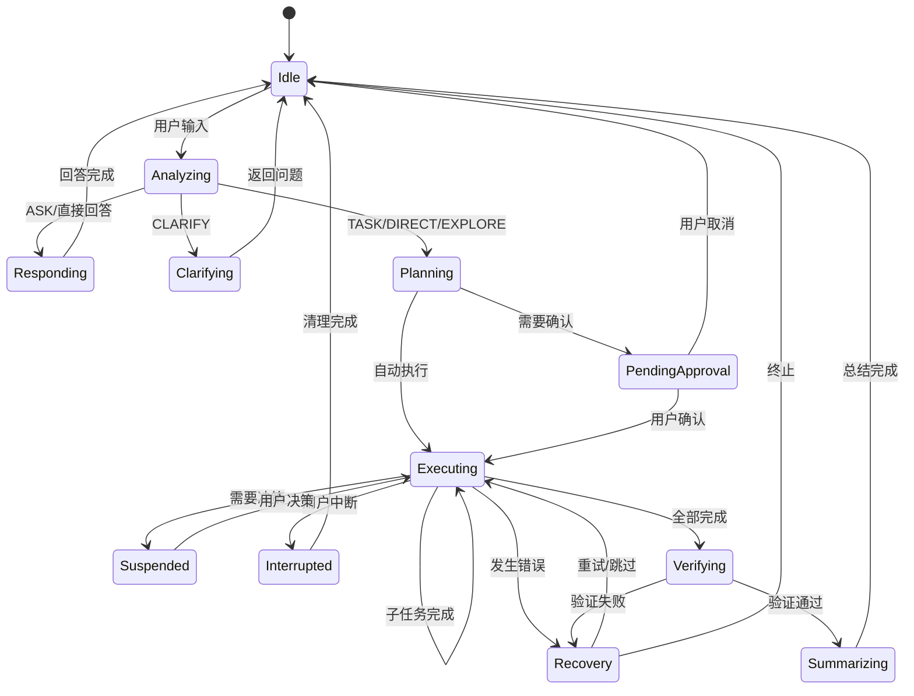

# Magi 统一工作流架构设计

> 版本: 3.0 | 更新日期: 2025-02-05

## 文档关系说明

本文档与 `ux-flow-specification.md` 是**共生关系**：

| 文档 | 定义 | 读者 |
|------|------|------|
| **ux-flow-specification.md** | UI 需要呈现什么（需求规范） | 前端开发/设计师 |
| **workflow-design.md**（本文档） | 工作流输出什么数据来支撑 UI（实现设计） | 后端/全栈开发 |

---

## 一、项目定位与目标

### 1.1 项目定位

Magi 是一个 **AI 驱动的多智能体编排开发插件**，核心特点：

| 特性 | 说明 |
|------|------|
| **语义理解驱动** | 通过 AI 理解用户意图，而非硬编码规则 |
| **多 Worker 协同** | 编排多个专业 Worker (Claude/Codex/Gemini) 协作完成复杂任务 |
| **编排者角色分离** | Orchestrator 只负责分析、规划、监控、汇总，不执行编码 |
| **统一消息协议** | 所有通信基于 StandardMessage，保证一致性 |
| **双区域 UI** | 主对话区（编排者叙事）+ Worker Tab（执行详情） |

### 1.2 核心设计原则

```text
┌────────────────────────────────────────────────────────────────┐
│                      设计原则金字塔                              │
├────────────────────────────────────────────────────────────────┤
│                                                                │
│                    ┌──────────────┐                            │
│                    │  语义优先    │  AI 理解 > 规则匹配         │
│                    └──────────────┘                            │
│               ┌────────────────────────┐                       │
│               │   职责清晰分离          │  编排者 vs Worker      │
│               └────────────────────────┘                       │
│          ┌──────────────────────────────────┐                  │
│          │      自然语言交互                 │  对话即控制       │
│          └──────────────────────────────────┘                  │
│     ┌────────────────────────────────────────────┐             │
│     │           持续可交互                        │  执行中仍可干预 │
│     └────────────────────────────────────────────┘             │
│                                                                │
└────────────────────────────────────────────────────────────────┘
```

### 1.3 不可违背的硬规则

| 规则 | 说明 |
|------|------|
| **编排者是唯一决策者** | 所有子系统（Todo、Worker、Tool）的使用都由编排者 LLM 语义理解决定 |
| **主对话区只接受编排者叙事** | Worker 不能直接发送到主对话区 |
| **Worker 只执行不决策** | Worker 只负责执行，通过汇报机制反馈给编排者 |
| **自然语言优先** | 所有用户干预通过自然语言完成 |

### 1.4 语义理解驱动的决策点

编排者需要在以下节点做出 LLM 语义决策：

1. **Phase 1 意图分类** - 这是什么类型的请求？快速路径还是深入分析？
2. **Phase 2 需求分析** - 用户想要什么？需要 Worker 吗？任务分类？执行模式？
3. **Phase 3 协作规划** - 哪些 Worker 参与？如何分配职责？复杂度如何？
4. **Phase 4 执行中** - 处理 Worker 汇报、错误恢复、用户中断
5. **Phase 5 总结** - 如何汇总结果？提供什么建议？

---

## 二、统一工作流总览

### 2.1 五阶段工作流

```text
┌─────────────────────────────────────────────────────────────────────────────┐
│                         Magi 统一工作流（5 阶段）                          │
├─────────────────────────────────────────────────────────────────────────────┤
│                                                                             │
│  用户输入                                                                    │
│     │                                                                       │
│     ▼                                                                       │
│  ┌─────────────────────────────────────────────────────────────────────┐   │
│  │              Phase 1: 意图门控 (Intent Gate)                          │   │
│  │  ┌─────────────────────────────────────────────────────────────┐    │   │
│  │  │ 快速分类：这是什么类型的请求？                                  │    │   │
│  │  │ 目的：决定走快速路径还是深入分析                                │    │   │
│  │  │ 输出: intent + recommendedMode + needsClarification           │    │   │
│  │  └─────────────────────────────────────────────────────────────┘    │   │
│  └─────────────────────────────────────────────────────────────────────┘   │
│     │                                                                       │
│     ├─── ASK ──────────────────────► 编排者直接回答（快速路径）              │
│     │                                                                       │
│     ├─── CLARIFY ──────────────────► 返回澄清问题（快速路径）                │
│     │                                                                       │
│     └─── TASK/DIRECT/EXPLORE/DEMO ─► 进入 Phase 2                           │
│           │                                                                 │
│           ▼                                                                 │
│  ┌─────────────────────────────────────────────────────────────────────┐   │
│  │         Phase 2: 需求分析 (Requirement Analysis)                      │   │
│  │  ┌─────────────────────────────────────────────────────────────┐    │   │
│  │  │ 深入理解 + 路由决策（合并）                                     │    │   │
│  │  │                                                               │    │   │
│  │  │ 输出:                                                         │    │   │
│  │  │ - goal: 用户想要达成什么                                       │    │   │
│  │  │ - acceptanceCriteria: 验收标准                                │    │   │
│  │  │ - needsWorker: 是否需要 Worker                                │    │   │
│  │  │ - categories: 任务分类                                        │    │   │
│  │  │ - executionMode: 执行模式                                      │    │   │
│  │  │ - delegationBriefings: Worker 委托说明                         │    │   │
│  │  └─────────────────────────────────────────────────────────────┘    │   │
│  │  【用户可见】展示需求理解 + 路由原因                                   │   │
│  └─────────────────────────────────────────────────────────────────────┘   │
│     │                                                                       │
│     ├─── needsWorker: false ───────► 编排者直接回答                         │
│     │                                                                       │
│     └─── needsWorker: true ────────►                                        │
│           │                                                                 │
│           ▼                                                                 │
│  ┌─────────────────────────────────────────────────────────────────────┐   │
│  │         Phase 3: 协作规划 (Collaboration Planning)                    │   │
│  │  ┌─────────────────────────────────────────────────────────────┐    │   │
│  │  │ - 选择 Worker：根据 categories 匹配                           │    │   │
│  │  │ - 分配职责：每个 Worker 的具体任务                              │    │   │
│  │  │ - 定义契约：Worker 间的协作协议                                 │    │   │
│  │  │ - 执行策略：复杂度分析、是否需要 Todo（TaskPreAnalyzer）         │    │   │
│  │  └─────────────────────────────────────────────────────────────┘    │   │
│  │  【用户可见】任务分配宣告                                             │   │
│  └─────────────────────────────────────────────────────────────────────┘   │
│     │                                                                       │
│     ▼                                                                       │
│  ┌─────────────────────────────────────────────────────────────────────┐   │
│  │         Phase 4: 任务执行 (Execution)                                 │   │
│  │  ┌─────────────────────────────────────────────────────────────┐    │   │
│  │  │ - 并行/串行/Wave 执行                                          │    │   │
│  │  │ - Worker 汇报处理                                              │    │   │
│  │  │ - 交互处理（提问、错误、中断、补充指令）                         │    │   │
│  │  │ - 验证（可选，根据 needsVerification）                          │    │   │
│  │  └─────────────────────────────────────────────────────────────┘    │   │
│  │  【用户可见】Worker 状态卡片 + Worker Tab 详情                        │   │
│  └─────────────────────────────────────────────────────────────────────┘   │
│     │                                                                       │
│     ▼                                                                       │
│  ┌─────────────────────────────────────────────────────────────────────┐   │
│  │         Phase 5: 总结 (Summary)                                       │   │
│  │  ┌─────────────────────────────────────────────────────────────┐    │   │
│  │  │ - 汇总所有 Worker 执行结果                                      │    │   │
│  │  │ - 提供下一步建议                                               │    │   │
│  │  └─────────────────────────────────────────────────────────────┘    │   │
│  │  【用户可见】最终总结                                                 │   │
│  └─────────────────────────────────────────────────────────────────────┘   │
│                                                                             │
└─────────────────────────────────────────────────────────────────────────────┘
```

### 2.2 阶段职责总览

| 阶段 | 名称 | 职责 | 输出 | 用户可见 |
|------|------|------|------|---------|
| Phase 1 | 意图门控 | 快速分类，决定走哪条路 | IntentDecision | 否（内部） |
| Phase 2 | 需求分析 | 深入理解 + 路由决策 | RequirementAnalysis | 是（需求理解） |
| Phase 3 | 协作规划 | 选 Worker、分职责、定策略 | Mission + ExecutionStrategy | 是（任务分配） |
| Phase 4 | 任务执行 | 执行 + 验证 | Worker 输出 | 是（状态卡片） |
| Phase 5 | 总结 | 汇总结果 | Result | 是（最终总结） |

### 2.3 处理模式决策树

```text
                              用户输入
                                 │
                                 ▼
                    ┌───────────────────────┐
                    │   Phase 1: 意图门控    │
                    │  (IntentGate.process)  │
                    └───────────────────────┘
                                 │
           ┌─────────┬─────────┼─────────┬─────────┬─────────┐
           ▼         ▼         ▼         ▼         ▼         ▼
       ┌───────┐ ┌───────┐ ┌───────┐ ┌───────┐ ┌───────┐ ┌───────┐
       │question│ │trivial│ │explore│ │ task  │ │ demo  │ │ambig. │
       └───────┘ └───────┘ └───────┘ └───────┘ └───────┘ └───────┘
           │         │         │         │         │         │
           ▼         ▼         ▼         ▼         ▼         ▼
       ┌───────┐ ┌───────┐ ┌───────┐ ┌───────┐ ┌───────┐ ┌───────┐
       │  ASK  │ │ DIRECT│ │EXPLORE│ │ TASK  │ │ DEMO  │ │CLARIFY│
       └───────┘ └───────┘ └───────┘ └───────┘ └───────┘ └───────┘
           │         │         │         │         │         │
           │         └────┬────┴────┬────┘         │         │
           │              ▼         ▼              │         │
           │    ┌───────────────────────────┐      │         │
           │    │  Phase 2: 需求分析         │      │         │
           │    │ (RequirementAnalysis)     │      │         │
           │    └───────────────────────────┘      │         │
           │              │                        │         │
           │    ┌─────────┴─────────┐              │         │
           │    ▼                   ▼              │         │
           │ needsWorker:false  needsWorker:true   │         │
           │    │                   │              │         │
           │    ▼                   ▼              ▼         ▼
           │ ┌─────┐           ┌─────────────┐ ┌─────┐  ┌─────────┐
            └►│直接 │           │ Phase 3-5   │ │转入 │  │返回澄清 │
              │回答 │           │ 完整流程    │◄┤TASK │  │问题     │
              └─────┘           └─────────────┘ └─────┘  └─────────┘
```

### 2.4 快速路径与轻量 Phase 2 规则

为符合“效率优先 + 低交互成本”的定位，DIRECT/EXPLORE 走快速路径，但仍允许进入轻量 Phase 2：

1. ASK / CLARIFY：直接快速路径，不进入 Mission。
2. DIRECT / EXPLORE：先执行轻量 Phase 2（RequirementAnalysis），若 `needsWorker=false` → 直接回答，若 `needsWorker=true` → 编排者强制转为 TASK，进入 Phase 3-5。
3. TASK / DEMO：直接进入完整流程（Phase 2 → Phase 3 → Phase 4 → Phase 5）。

---

## 三、核心接口定义

### 3.1 IntentDecision

```typescript
interface IntentDecision {
  /** 意图类型（用于分析/记录） */
  intent: 'question' | 'trivial' | 'exploratory' | 'task' | 'demo' | 'ambiguous' | 'open_ended';
  /** 推荐的处理模式 */
  recommendedMode: 'ask' | 'direct' | 'explore' | 'task' | 'demo' | 'clarify';
  /** 置信度 (0-1) */
  confidence: number;
  /** 是否需要澄清 */
  needsClarification: boolean;
  /** 澄清问题 */
  clarificationQuestions?: string[];
  /** 决策理由 */
  reason: string;
}
```

> **调用时机**：Phase 1（意图门控）
> **目的**：快速分类，决定走快速路径还是深入分析
> **代码位置**：`intent-gate.ts`

### 3.2 RequirementAnalysis

```typescript
interface RequirementAnalysis {
  // ===== 目标理解 =====
  /** 用户想要达成什么 */
  goal: string;
  /** 任务的复杂度和关键点 */
  analysis: string;
  /** 任何限制条件 */
  constraints?: string[];
  /** 验收标准 */
  acceptanceCriteria?: string[];
  /** 风险评估 */
  riskLevel?: 'low' | 'medium' | 'high';
  /** 可能的风险因素 */
  riskFactors?: string[];

  // ===== 路由决策 =====
  /** 是否需要 Worker */
  needsWorker: boolean;
  /** needsWorker=false 时的直接回复 */
  directResponse?: string;
  /** 任务分类（用于选择 Worker） */
  categories?: string[];
  /** 执行模式 */
  executionMode?: 'direct' | 'sequential' | 'parallel' | 'dependency_chain';
  /** Worker 委托说明 */
  delegationBriefings?: string[];
  /** 是否需要工具调用 */
  needsTooling?: boolean;
  /** 是否需要修改文件 */
  requiresModification?: boolean;
  /** 决策原因（展示给用户） */
  reason: string;
}
```

> **调用时机**：Phase 2（需求分析）
> **目的**：深入理解用户需求 + 路由决策（合并原目标理解和路由决策）
> **代码位置**：`mission-driven-engine.ts` 的 `analyzeRequirement()` 方法

### 3.3 ExecutionStrategy

```typescript
interface ExecutionStrategy {
  /** 任务复杂度 */
  complexity: 'simple' | 'moderate' | 'complex';
  /** 是否需要规划阶段 */
  needsPlanning: boolean;
  /** 是否需要评审阶段 */
  needsReview: boolean;
  /** 是否需要验证阶段 */
  needsVerification: boolean;
  /** 是否并行执行 */
  parallel: boolean;
  /** 策略说明 */
  reasoning: string;
  /** 编排者的分析摘要（用于 UI 展示） */
  analysisSummary: string;
}
```

> **调用时机**：Phase 3（协作规划）
> **依赖信息**：需要 Mission 和 Assignments 才能准确分析
> **代码位置**：`task-pre-analyzer.ts`

### 3.4 ExecutionPlan

```typescript /Users/xie/code/Magi/src/orchestrator/protocols/types.ts
interface ExecutionPlan {
  id: string;
  analysis: string;
  isSimpleTask?: boolean;
  needsWorker?: boolean;
  directResponse?: string;
  needsUserInput?: boolean;
  questions?: string[];
  skipReason?: string;
  needsCollaboration: boolean;
  subTasks: SubTask[];
  executionMode: 'parallel' | 'sequential';
  summary: string;
  featureContract: string;
  acceptanceCriteria: string[];
  createdAt: number;
  riskLevel?: 'low' | 'medium' | 'high' | 'critical';
}
```

> **调用时机**：Phase 2 → Phase 3 之间
> **目的**：为协作规划与 UI 计划卡片提供结构化输入
> **代码位置**：`protocols/types.ts`

---

## 四、状态机设计

### 4.1 引擎状态机



### 4.2 状态说明

| 状态 | 描述 | 用户可操作 |
|------|------|-----------|
| **Idle** | 空闲，等待用户输入 | 发送消息 |
| **Analyzing** | 分析意图中 | 无 |
| **Responding** | 直接回答中 | 无 |
| **Clarifying** | 返回澄清问题 | 回答问题 |
| **Planning** | 规划任务中 | 中断 |
| **PendingApproval** | 等待用户确认计划 | 确认/取消/修改 |
| **Executing** | Worker 执行中 | 补充指令/停止 |
| **Suspended** | 等待用户决策 | 回答问题/选择选项 |
| **Recovery** | 错误恢复中 | 重试/跳过/回滚/停止 |
| **Interrupted** | 已中断 | 无 |
| **Verifying** | 验证结果中 | 无 |
| **Summarizing** | 生成总结中 | 无 |

### 4.3 文档状态与实现状态对照

为避免状态语义漂移，以下为文档状态到实现状态的对照表：

| 文档状态 | 实现状态（代码） |
|---------|------------------|
| Idle | idle |
| Analyzing | analyzing |
| Responding | running |
| Clarifying | clarifying / waiting_questions |
| Planning | dispatching |
| PendingApproval | waiting_confirmation |
| Executing | monitoring |
| Suspended | waiting_worker_answer |
| Recovery | recovering |
| Interrupted | failed / completed（视中断处理） |
| Verifying | verifying |
| Summarizing | summarizing |

> **说明**：实现状态更加细化（dispatching/monitoring/integrating 等），文档以可理解性为主，并通过对照表保持一致性。

---

## 五、核心组件架构

### 5.1 组件架构图

```text
┌─────────────────────────────────────────────────────────────────────────┐
│                            MissionDrivenEngine                           │
│  ┌───────────────────────────────────────────────────────────────────┐  │
│  │                         统一入口: execute()                         │  │
│  └───────────────────────────────────────────────────────────────────┘  │
│                                    │                                     │
│     ┌──────────────────────────────┼──────────────────────────────┐     │
│     ▼                              ▼                              ▼     │
│ ┌─────────────┐            ┌─────────────┐            ┌─────────────┐  │
│ │ IntentGate  │            │ MissionOrch │            │ MessageHub  │  │
│ │ 意图门控     │            │ 任务编排     │            │ 消息中心     │  │
│ └─────────────┘            └─────────────┘            └─────────────┘  │
│       │                          │                          │          │
│       │                    ┌─────┴─────┐                    │          │
│       ▼                    ▼           ▼                    ▼          │
│ ┌───────────────┐   ┌───────────┐ ┌───────────┐   ┌───────────────┐   │
│ │ 意图分类器     │   │ Execution │ │ Autonomous│   │ 消息分类器     │   │
│ │ (AI 驱动)     │   │Coordinator│ │  Worker   │   │ (UI 路由)     │   │
│ └───────────────┘   └───────────┘ └───────────┘   └───────────────┘   │
│                           │              │                             │
│                     ┌─────┴─────────────┴─────┐                        │
│                     ▼                         ▼                        │
│              ┌───────────────┐        ┌───────────────┐                │
│              │ AdapterFactory│        │ ProfileLoader │                │
│              │ (LLM 适配器)  │        │ (Worker 配置) │                │
│              └───────────────┘        └───────────────┘                │
└─────────────────────────────────────────────────────────────────────────┘
```

### 5.2 组件职责矩阵

| 组件 | 职责 | 核心方法 |
|------|------|---------|
| **MissionDrivenEngine** | 统一入口，协调全流程 | `execute()`, `stop()`, `injectInstruction()` |
| **IntentGate** | AI 意图分类 | `process(prompt)` → intent, mode |
| **MissionOrchestrator** | Mission 生命周期 | `processRequest()`, `execute()`, `verify()` |
| **ExecutionCoordinator** | Worker 执行协调 | `execute()` |
| **AutonomousWorker** | 自主任务执行 | `execute(assignment)` |
| **MessageHub** | 统一消息出口 | `result()`, `workerOutput()`, `taskAssignment()` |
| **AdapterFactory** | LLM 调用抽象 | `sendMessage()` |
| **ProfileLoader** | Worker 配置加载 | `getWorkerForCategory()` |

### 5.3 关键文件清单

| 文件 | 职责 |
|------|------|
| `intent-gate.ts` | 意图分类，输出 IntentDecision |
| `mission-orchestrator.ts` | 任务编排，Mission 生命周期管理 |
| `mission-driven-engine.ts` | 引擎入口，统一决策流程 |
| `task-pre-analyzer.ts` | 执行策略分析 |
| `autonomous-worker.ts` | Worker 执行逻辑 |
| `message-hub.ts` | 消息路由 |
| `execution-coordinator.ts` | 多 Worker 执行协调 |
| `message-protocol.ts` | 统一消息协议与类型 |
| `verification-runner.ts` | 验证执行入口 |
| `review-executor.ts` | 评审执行器 |
| `contract-verifier.ts` | 契约/验收验证 |

---

## 六、场景覆盖矩阵

### 6.1 意图 → 模式 → 流程映射

| 意图类型 | 处理模式 | 是否需要 Worker | 执行流程 |
|---------|---------|----------------|---------|
| question | ASK | 否 | Phase 1 → 快速路径（直接回答） |
| trivial | DIRECT | 是（Phase 2 决定） | Phase 1 → Phase 2 → Phase 3-5 |
| exploratory | EXPLORE | 是（Phase 2 决定） | Phase 1 → Phase 2 → Phase 3-5 |
| task | TASK | 是 | Phase 1 → Phase 2 → Phase 3 → Phase 4 → Phase 5 |
| demo | DEMO | 是 | Phase 1 → 自选场景 → Phase 2-5 |
| ambiguous | CLARIFY | 否 | Phase 1 → 快速路径（返回澄清问题） |
| open_ended | 由 LLM 决策 | 视 Phase 2 结果 | 根据 recommendedMode 决定 |

### 6.2 完整场景覆盖

> 场景编号与 ux-flow-specification.md 保持一致

| 场景 | 描述 | 触发示例 | 处理流程 |
|------|------|---------|---------|
| 基础流程 | 单 Worker 线性执行 | "重构这个函数" | 意图→TASK→Mission→执行→总结 |
| 场景 1 | 多 Worker 并行执行 | "分析前后端问题" | 并行派发→各自执行→统一汇总 |
| 场景 2 | Worker 依赖链执行 | "分析→设计→重构" | 串行派发→上下文传递→逐步执行 |
| 场景 3 | Worker 提问 | Worker 遇到歧义 | Suspended→转述问题→用户回复→继续 |
| 场景 4 | 错误与恢复 | Worker 执行失败 | Recovery→列出选项→用户选择→执行策略 |
| 场景 5 | 用户中断 | 点击停止 | 立即终止→报告进度 |
| 场景 6 | Todo 动态变更 | Worker 发现新步骤 | Suspended→询问确认→更新列表→继续 |

### 6.3 其他场景

| 场景 | 触发示例 | 处理流程 |
|------|---------|---------|
| 问答直答 | "你是谁" | 意图→ASK→直答 |
| 简单修改 | "改个变量名" | 意图→DIRECT→路由→快速执行 |
| 代码分析 | "分析这段代码" | 意图→EXPLORE→路由→分析 |
| 演示测试 | "随便测试一下" | 意图→DEMO→自选场景→TASK |
| 需要澄清 | "优化一下" | 意图→CLARIFY→返回问题 |
| 用户补充指令 | "不要改 utils" | 存入队列→决策点注入 |

---

## 七、消息类型与路由

### 7.1 Protocol 层消息类型

| MessageType | 说明 |
|-------------|------|
| TEXT | 文本消息 |
| PLAN | 规划消息 |
| PROGRESS | 进度更新 |
| RESULT | 结果/总结 |
| ERROR | 错误消息 |
| INTERACTION | 交互请求 |
| SYSTEM | 系统消息 |
| TOOL_CALL | 工具调用 |
| THINKING | 思考过程 |
| USER_INPUT | 用户输入 |
| TASK_CARD | 任务状态卡片 |
| INSTRUCTION | 任务说明 |

### 7.1.1 MessageCategory（统一消息通道）

| MessageCategory | 说明 |
|---------------|------|
| CONTENT | 内容消息（LLM 输出/结果） |
| CONTROL | 控制消息（阶段/任务状态） |
| NOTIFY | 通知消息（Toast） |
| DATA | 数据消息（状态同步） |

### 7.1.2 ControlMessageType（控制消息子类型）

| ControlMessageType | 说明 |
|--------------------|------|
| PHASE_CHANGED | 阶段变化 |
| TASK_STARTED | 任务开始 |
| TASK_COMPLETED | 任务完成 |
| TASK_FAILED | 任务失败 |
| WORKER_STATUS | Worker 状态更新 |

### 7.1.3 DataMessageType（数据消息子类型）

用于后端向前端同步状态，例如 `sessionLoaded`、`missionPlanned`、`workerStatusUpdate` 等。

### 7.2 消息路由规则

| 来源 | MessageType | 路由目标 | 说明 |
|------|-------------|---------|------|
| orchestrator | TEXT | 主对话区 | 编排者叙事 |
| orchestrator | PLAN | 主对话区 | 任务规划 |
| orchestrator | RESULT | 主对话区 | 最终结果 |
| orchestrator | TASK_CARD | 主对话区 | Worker 状态卡片 |
| orchestrator | INSTRUCTION | Worker Tab | 任务说明 |
| worker | THINKING | Worker Tab | 思考过程 |
| worker | TOOL_CALL | Worker Tab | 工具调用 |
| worker | TEXT | Worker Tab | Worker 输出 |
| worker | RESULT | Worker Tab | Worker 摘要 |
| worker | ERROR | 主对话区 | 错误提醒（强制路由） |

### 7.3 内部决策 vs 用户可见

| 阶段 | 可见性 | 实现方式 |
|------|-------|---------|
| Phase 1 意图门控 | 内部 | `streamToUI: false` |
| Phase 2 需求分析 | 可见 | `orchestratorMessage()` 展示需求理解 |
| Phase 3 协作规划 | 可见 | `taskAssignment({reason})` |
| Phase 4 执行 | 可见 | `workerStatusCard()` + Worker Tab |
| Phase 5 总结 | 可见 | `result()` |

### 7.4 消息流硬规则

- ❌ Worker **永远不能**直接发送消息到主对话区
- ✅ Worker 必须通过 WorkerReport 汇报给编排者
- ✅ 编排者决定是否/如何将 Worker 信息展示在主对话区

---

## 八、执行模式详解

### 8.1 Direct 模式（简单任务）

```text
用户: "帮我把 hello 改成 world"
    ↓
Phase 2 需求分析: 简单任务，无需 Todo
    ↓
RequirementAnalysis: { needsWorker: true, executionMode: 'direct' }
    ↓
Worker 收到 Assignment.responsibility → 直接执行 → 汇报结果
    ↓
Phase 5 总结
```

### 8.2 Sequential 模式（复杂任务）

```text
用户: "重构这个模块的错误处理"
    ↓
Phase 2 需求分析: 复杂任务，需要 Todo 分解
    ↓
RequirementAnalysis: { needsWorker: true, executionMode: 'sequential' }
    ↓
Phase 3 协作规划: ExecutionStrategy { needsPlanning: true }
    ↓
Worker 规划 Todos → 执行每个 Todo → 汇报进度 → 下一个
    ↓
Phase 5 总结
```

### 8.3 Parallel 模式（多 Worker 并行）

```text
用户: "同时优化前端组件和后端 API"
    ↓
Phase 2 需求分析: 多领域任务，无依赖
    ↓
RequirementAnalysis: { categories: ['frontend', 'backend'], executionMode: 'parallel' }
    ↓
Worker A 执行前端 ──┬── 同时 ──┬── Worker B 执行后端
                   ↓          ↓
               完成后汇总 ← ──┘
    ↓
Phase 5 总结
```

### 8.4 Dependency Chain 模式（依赖链）

```text
用户: "设计新的数据模型，然后更新 API，最后更新前端"
    ↓
Phase 2 需求分析: 有依赖关系的多阶段任务
    ↓
RequirementAnalysis: {
  categories: ['architecture', 'backend', 'frontend'],
  executionMode: 'dependency_chain'
}
    ↓
Worker A 完成架构设计 → 契约输出
    ↓
Worker B 消费契约 → 完成 API → 契约输出
    ↓
Worker C 消费契约 → 完成前端
    ↓
Phase 5 总结
```

### 8.5 Wave 分批执行

```text
依赖图:
  A ──┐
      ├──► C ──► E
  B ──┘         ▲
                │
  D ────────────┘

Wave 分解:
  Wave 1: [A, B, D] (并行)
  Wave 2: [C]
  Wave 3: [E]
```

> **实现说明**：Wave 执行由 ExecutionCoordinator 发射 `waveStarted` / `waveCompleted` 事件，当前用于内部日志与调度统计，UI 暂无专属卡片。

---

## 九、交互处理机制

### 9.1 Worker 提问

```text
Worker → WorkerReport(type: question) → Orchestrator
    ↓
Orchestrator → 转述问题到主对话区（自然语言）
    ↓
用户回复 → Orchestrator → 传递给 Worker → 继续执行
```

### 9.2 错误恢复

```text
Worker → WorkerReport(type: failed) → Orchestrator
    ↓
Orchestrator LLM 分析失败原因 → 决定恢复策略
    ↓
在主对话区用自然语言询问用户意见
    ↓
用户回复 → Orchestrator 执行恢复策略（重试/跳过/回滚）
```

### 9.3 用户中断

```text
用户点击停止按钮 → Orchestrator 中止所有 Worker
    ↓
保存当前 Session 状态
    ↓
汇报执行进度
    ↓
用户可发送"继续"指令恢复
```

### 9.4 补充指令处理

```text
用户在执行中发送消息 → 暂存为补充指令
    ↓
在下一个决策点注入
    ↓
影响后续执行
```

### 9.5 执行中用户输入分类

```text
用户输入
    │
    ├─── 包含"停止/取消/stop" ──► 立即中断
    │
    ├─── 引擎在 Suspended/Recovery ──► 作为决策响应
    │
    └─── 引擎在 Executing ──► 作为补充指令
                              ├─ 存入 SupplementaryQueue
                              └─ 在下一决策点注入
```

### 9.6 决策点定义

| 决策点类型 | 触发时机 | 代码位置 |
|-----------|---------|---------|
| 工具调用前 | Worker 准备执行工具 | `AutonomousWorker.executeToolCall()` 前 |
| 工具调用后 | 工具执行完毕 | `AutonomousWorker.executeToolCall()` 后 |
| 步骤边界 | 完成一个 Todo | `AutonomousWorker.completeTodo()` 后 |
| 思考完成 | 一轮思考结束 | `WorkerAdapter.onThinkingComplete()` |

### 9.7 补充指令注入示例

```text
用户发送: "别改 utils 目录"
         ↓
存入 SupplementaryQueue
         ↓
Worker 继续当前步骤（不中断）
         ↓
到达决策点（准备修改下一个文件）
         ↓
Orchestrator 注入: "[System] 用户补充指令：跳过 utils 目录下的文件"
         ↓
Worker 调整后续行为
```

### 9.8 Todo 动态变更

```text
Worker 发现需要新增 Todo → WorkerReport(type: progress, dynamicTodos)
    ↓
Orchestrator → 询问用户确认
    ↓
用户确认 → 更新 Todo 列表 → 继续执行
```

---

## 十、异常处理与恢复

### 10.1 异常类型与处理策略

| 异常类型 | 触发条件 | 处理策略 | 用户选项 |
|---------|---------|---------|---------|
| Worker 执行失败 | 工具调用失败/LLM 超时 | 进入 Recovery | 重试/跳过/回滚/停止 |
| 依赖链中断 | 前序任务失败 | 阻塞后续任务 | 换 Worker/跳过/回滚 |
| 用户中断 | 点击停止按钮 | 立即终止 | 报告进度 |
| 验证失败 | 结果不满足验收标准 | 提供恢复选项 | 重试/回滚/继续 |

### 10.2 恢复策略

| 策略 | 行为 | 适用场景 |
|------|------|---------|
| 重试 | 重新执行失败步骤 | 临时错误（网络超时） |
| 跳过 | 标记跳过，继续后续 | 非关键步骤 |
| 回滚 | 恢复文件快照 | 需要撤销修改 |
| 停止 | 终止整个任务 | 无法继续 |

### 10.3 回滚能力

| 操作类型 | 可回滚性 | 回滚方式 |
|---------|---------|---------|
| 文件修改 | ✅ | SnapshotManager |
| 文件创建 | ✅ | 删除新建文件 |
| 文件删除 | ⚠️ | Git restore（如有） |
| 外部 API | ❌ | 仅记录日志 |

---

## 十一、扩展点设计

### 11.1 可扩展组件

| 扩展点 | 接口 | 说明 |
|-------|------|------|
| Worker 注册 | ProfileLoader | 新增 Worker 类型 |
| 意图分类器 | IntentGate.setDecider | 自定义分类逻辑 |
| LLM 适配器 | AdapterFactory.register | 新增 LLM 提供商 |
| 消息处理器 | MessageHub.on | 消息持久化/同步 |
| 执行策略 | ExecutionCoordinator | 自定义调度策略 |

---

## 十二、UX 场景与消息输出对照

> 本章节明确 ux-flow-specification.md 每个 UI 效果对应的工作流输出

### 12.1 基础流程：单 Worker 线性执行

| 工作流阶段 | UI 呈现 | MessageType | MessageHub API |
|-----------|---------|-------------|----------------|
| Phase 1 | （内部，不可见） | - | - |
| Phase 2 | 思考(可折叠) + 需求理解 | TEXT | `orchestratorMessage()` |
| Phase 3 | Worker 卡片(🟡执行中) | TASK_CARD | `workerStatusCard()` |
| Phase 4 | 任务说明 + 思考 + 工具 | INSTRUCTION + THINKING + TOOL_CALL | `workerInstruction()` + Worker 输出 |
| Phase 4 | Worker 卡片(✅完成) | TASK_CARD | `workerStatusCard()` 更新状态 |
| Phase 5 | 最终汇总 | RESULT | `result()` |

**消息序列**:

```text
USER_INPUT → TEXT(需求理解) → TASK_CARD(running) → INSTRUCTION
          → THINKING* → TOOL_CALL* → TASK_CARD(completed) → RESULT
```

### 12.2 场景 1: 多 Worker 并行执行

| UX 效果 | 工作流输出 |
|--------|-----------|
| "我将安排两个 Worker 并行分析" | `taskAssignment([...], {reason})` |
| Worker A 卡片(🟡执行中) | `workerStatusCard('claude', {status: 'running'})` |
| Worker B 卡片(🟡执行中) | `workerStatusCard('gemini', {status: 'running'})` |
| Worker A 完成(✅) | `workerStatusCard()` 更新 status: completed |
| Worker B 完成(✅) | `workerStatusCard()` 更新 status: completed |
| 编排者汇总 | `result()` 合并所有 Worker 结果 |

**关键约束**：汇总时机 = 全部 Worker 完成后

### 12.3 场景 2: Worker 依赖链执行

| UX 效果 | 工作流输出 |
|--------|-----------|
| Worker A 卡片显示 [1/3] | `workerStatusCard()` 带 sequence 信息 |
| Worker A 完成后自动触发 B | ExecutionCoordinator 串行调度 |
| Worker B 任务说明包含 A 的输出摘要 | `workerInstruction()` 注入 previousOutput |

**上下文传递示例**：

```typescript
workerInstruction({
  responsibility: '设计重构方案',
  previousOutput: 'Worker A 分析结果：识别出 5 个模块...',
  sequence: { current: 2, total: 3 }
});
```

### 12.4 场景 3: Worker 提问

| UX 效果 | 工作流输出 | 触发条件 |
|--------|-----------|---------|
| Worker 卡片"等待确认" | `workerStatusCard()` status: pending | Worker 发送 INTERACTION |
| 编排者转述问题 | `orchestratorMessage()` | 收到 WorkerReport(question) |
| 用户回复 | USER_INPUT | 用户发送消息 |
| Worker 恢复执行 | `workerStatusCard()` status: running | 编排者传递答案 |

### 12.5 场景 4: 错误与恢复

| UX 效果 | 工作流输出 |
|--------|-----------|
| Worker 卡片(❌失败) | `workerStatusCard()` status: failed |
| 编排者列出恢复选项 | `orchestratorMessage()` 列出选项 |
| 用户选择"跳过" | USER_INPUT |
| 编排者确认跳过 | `orchestratorMessage('已跳过...')` |
| 继续下一任务 | 新的 `workerStatusCard()` |

### 12.6 场景 5: 用户中断

| UX 效果 | 工作流输出 |
|--------|-----------|
| 所有 Worker 卡片(⏹️已停止) | 批量更新 `workerStatusCard()` status: stopped |
| 编排者汇报进度 | `orchestratorMessage()` 包含执行进度 |

### 12.7 场景 6: Todo 动态变更

| UX 效果 | 工作流输出 |
|--------|-----------|
| Worker 卡片"发现需要额外步骤" | `workerStatusCard()` status: pending |
| 编排者询问确认 | `orchestratorMessage()` 解释原因 |
| 用户同意 | USER_INPUT |
| Worker 卡片更新步骤 | `workerStatusCard()` 更新描述 |

### 12.8 补充指令与决策点

| UX 效果 | 工作流处理 |
|--------|-----------|
| 执行中用户发送消息 | 存入 SupplementaryQueue |
| 消息显示在主对话区 | 前端直接渲染 USER_INPUT |
| 编排者确认收到 | `orchestratorMessage('收到，我会通知...')` |
| 决策点到达时注入 | Worker 下一步执行时注入补充指令 |

### 12.9 Wave 执行输出（当前实现）

| UX 效果 | 工作流输出 |
|--------|-----------|
| Wave 开始/结束 | 事件 `waveStarted` / `waveCompleted`（内部日志） |
| UI 展示 | 当前无专属卡片，复用子任务卡片状态变化 |

---

## 十三、实现检查清单

### 13.1 核心流程

- [x] Phase 1 意图门控 AI 驱动 (IntentGate)
- [x] Phase 2 需求分析（目标理解+路由决策合并）
- [x] Phase 1 内部决策不输出 UI (streamToUI: false)
- [x] Phase 2 展示需求理解 + 路由原因
- [x] Phase 3 任务分配宣告 (taskAssignment + reason)
- [x] 单 Worker 执行 (AutonomousWorker)
- [x] 多 Worker 并行 (ExecutionCoordinator)
- [x] 依赖链串行 (TaskDependencyGraph)
- [x] Wave 分批执行 (useWaveExecution)
- [x] 评审阶段可选执行 (review-executor)
- [x] 验证阶段可选执行 (verification-runner)

### 13.2 UX 场景覆盖

- [x] 基础流程：单 Worker 线性执行
- [x] 场景 1：多 Worker 并行执行
- [x] 场景 2：Worker 依赖链执行
- [x] 场景 3：Worker 提问
- [x] 场景 4：错误与恢复
- [x] 场景 5：用户中断
- [x] 场景 6：Todo 动态变更
- [x] 补充指令与决策点

### 13.3 消息路由

- [x] 编排者叙事 → 主对话区
- [x] Worker 状态卡片 → 主对话区
- [x] Worker 任务说明 → Worker Tab
- [x] Worker 思考/工具/输出 → Worker Tab
- [x] 错误消息 → 主对话区
- [x] Phase 1 内部决策 → 不显示

---

## 十四、总结

本文档定义了 Magi 的统一工作流架构（5 阶段设计），核心特点：

1. **5 阶段流程**：意图门控 → 需求分析 → 协作规划 → 执行 → 总结
2. **语义驱动**：通过 AI 理解用户意图，非硬编码规则
3. **快速路径**：ASK/CLARIFY 直接处理，无需深入分析
4. **渐进式决策**：Phase 1 快速分类，Phase 2 深入理解+路由，Phase 3 执行策略
5. **职责分离**：编排者规划监控，Worker 执行任务
6. **场景覆盖**：从简单问答到复杂多 Worker 协作
7. **消息统一**：StandardMessage 协议保证一致性
8. **UX 共生**：每个 UI 效果都有明确的工作流输出对应
9. **可扩展**：Worker、LLM、意图分类等均可扩展

该架构已在现有代码中实现，本文档作为设计规范供后续开发维护参考。
